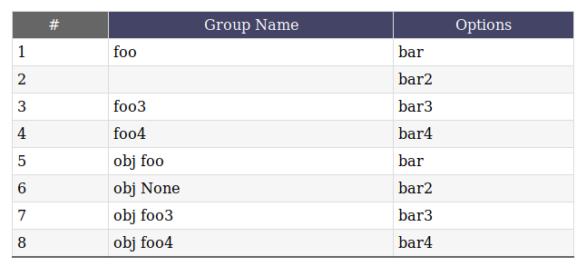
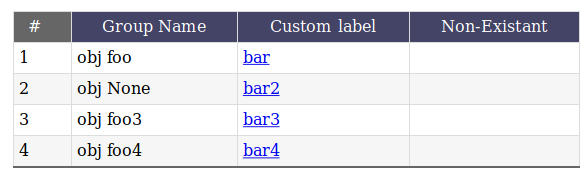
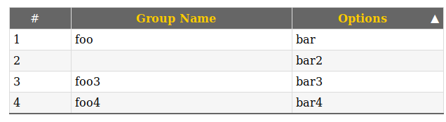

Basic Usage
===========

What grid is about?
-------------------

This class is designed to aid programmer in the task of creation of
tables/grids - structures that are mostly built from lists/iterables of data rows.

The system allows you to hook your favourite framework and datasource and
generate markup from it.

**Supported features:**

* auto generated headers
* headers allow you to generate clikable links for data ordering based on columns
* support for auto numbering resultset in separate columns
* header name auto generation
* extensive customizability
* framework agnostic solution
* works with iterables of objects/dictionaries/tuples
* default generated markup contains lots of css handy for styling

Basic Example
-------------

Creating a basic grid object:

To create a grid at minimum one one needs to pass a dataset,
like an iterable of objects or dictionaries:

    grid = Grid(itemlist, ['c1', 'c2','c4'])

where itemlist in this simple scenario is a list of dicts:

    [{'c1':1,'c2'...}, {'c1'...}, ...]

This helper also received the list that defines order in which
columns will be rendered.

Item number column
------------------

A special column name that can be passed in list that defines
order - ``_numbered`` - this adds additional column that shows the number of item:

.. literalinclude:: ../tests/tests.py
    :language: python
    :lines: 78

For paging sql data there one can pass
``start_number`` argument to the grid to define where to start counting.
Descendant sorting on ``_numbered`` column decrements the value, you can
change how numbering function behaves by overloading ``calc_row_no``
property.

Resulting rendering:

Basic template output
---------------------

Converting the grid to a string renders the table rows. By default that's *just*
the <tr> tags, not the <table> around them. The part outside the <tr>s
have too many variations for us to render it. In many template systems (like jinja2/mako,
you can simply assign the grid to a template variable and it will be
automatically converted to a string. Example using a Jinja2 template:

.. code-block:: html

    <table class="stylized">
    <caption>My Lovely Grid</caption>
    {{ grid }}
    </table>

Customizing column names
------------------------

The names of the columns will get automatically converted for
humans ie. foo_bar becomes Foo Bar. If you want the title to be something
else you can change the grid.labels dict. If you want the column ``part_no``
to become ``Catalogue Number`` just do::

    grid = Grid(itemlist, ['_numbered','part_name', 'part_no'])
    grid.labels["part_no"] = u'Catalogue Number'

You can also control all aspects of grid rendering/behavior by creating your own subclasses of Grid.

Fetching the data from row/Customizing column cell markup
---------------------------------------------------------

Since various programmers have different needs, Grid is highly customizable.
By default grid attempts to read the value from object attributes (``getattr(record, column)``)
if this fails there will be an attempt to read it via ``record.get(column)``, if this fails
``None`` value will be used instead.
For every column it will try to output value of current_row['colname'].

Since very often this behavior needs to be overridden like we need date
formatted, use conditionals or generate a link one can use
the  ``column_formats`` dict and pass a rendering function to it.
For example we want to apppend ``foo`` to part number:

.. literalinclude:: ../tests/tests.py
    :language: python
    :lines: 56-75

Resulting rendering:

Controlling which columns allow sorting the data
------------------------------------------------

It may be desired to exclude some or all columns from generation sorting
urls (used by subclasses that are sorting aware). You can use grids
exclude_ordering property to pass list of columns that should not support
sorting. By default sorting is disabled - this ``exclude_ordering`` contains
every column name::

    grid = CustomGrid(itemlist, ['_numbered','part_name', 'part_no'],
                order_column='options', order_direction='asc',
                request=requestObj)
    #enable ordering support
    grid.exclude_ordering = []

Since grid is framework agnostic the url generator is not working out-of-the-box,
you will need to subclass grid object and override a special method called
`generate_header_link` implementing ordering there.

Whole operation consists of setting self.order_column and self.order_dir to
their CURRENT values,and generating new urls passed as labels for state
that header should set set after its clicked.:

Example implementation for pyramid app (but flask/pylons/django should be the
same with the exception of handling of request object implementation/url generator)::

    from webhelpers2.html.builder import HTML

    class CustomGrid(Grid):
        """
        Subclass of Grid that can handle header link generation for quick building
        of tables that support ordering of their contents, paginated results etc.
        """

        def generate_header_link(self, column_number, column, label_text):
            """ This handles generation of link and then decides to call
            self.default_header_ordered_column_format
            or
            self.default_header_column_format
            based on if current column is the one that is used for sorting or not
            """

            # implementation START #
            # this will handle possible URL generation
            GET_copy = self.request.copy().GET.mixed()

            self.order_column = GET_copy.pop("order_col", None)
            self.order_dir = GET_copy.pop("order_dir", None)

            if column == self.order_column and self.order_dir == "asc":
                new_order_dir = "dsc"
            else:
                new_order_dir = "asc"

            GET_copy['order_col'] = column
            GET_copy['order_dir'] = new_order_dir

            url = self.request.current_route_url(_query=GET_copy)

            label_text = HTML.tag("a", href=url, c=label_text)
            # implementation END #
            # Is the current column the one we're ordering on?
            if column == self.order_column:
                return self.default_header_ordered_column_format(column_number,
                                                                 column,
                                                                 label_text)
            else:
                return self.default_header_column_format(column_number, column,
                                                         label_text)

Resulting rendering:

Working with other item types
-----------------------------

The module also includes `ListGrid` where the difference between default grid
is how default column format function handles data fetching from objects. It
is a good example how quickly and easy one can customize all aspects of grid behavior.

Order markers
-------------

Ordered columns by default include marker spans that you can easly stylize using
CSS to contain arrows or images showing order direction.

Example::

    

Customizing row markup
----------------------
You can customize the grids look and behavior by overloading grids instance
render functions, bu subclassing and reimplementing those functions you can
output ul/div or any other markup you desire:

**grid.default_column_format** (self, column_number, i, record, column_name)
by default generates markup like::

    <td class="cNO">VALUE</td>

**grid.default_header_column_format** (self, column_number, column_name,
    header_label)

by default generates markup like::

    <td class="cNO COLUMN_NAME">VALUE</td>

**grid.default_header_ordered_column_format** (self, column_number, order,
    column_name, header_label):

Used by grids that support ordering of columns in the grid like,
webhelpers.pylonslib.grid.GridPylons.
by default generates markup like::

    <td class="cNO ordering ORDER_DIRECTION COLUMN_NAME">LABEL</td>

**grid.default_header_record_format** (self, headers)
by default generates markup like::

    <tr class="header">HEADERS_MARKUP</tr>

**grid.default_record_format** (self, i, record, columns)
Make an HTML table from a list of objects, and soon a list of
sequences, a list of dicts, and a single dict.::

    <tr class="ODD_OR_EVEN">RECORD_MARKUP</tr>

**grid.generate_header_link** (self, column_number, column, label_text)
by default just sets the order direction and column properties for grid.

Actual link generation is handled by subclasses of Grid.

**grid.numbered_column_format** (self, column_number, i, record)
by default generates markup like::

    <td class="cNO">RECORD_NO</td>

